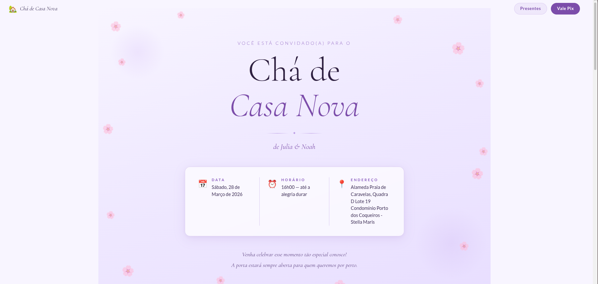
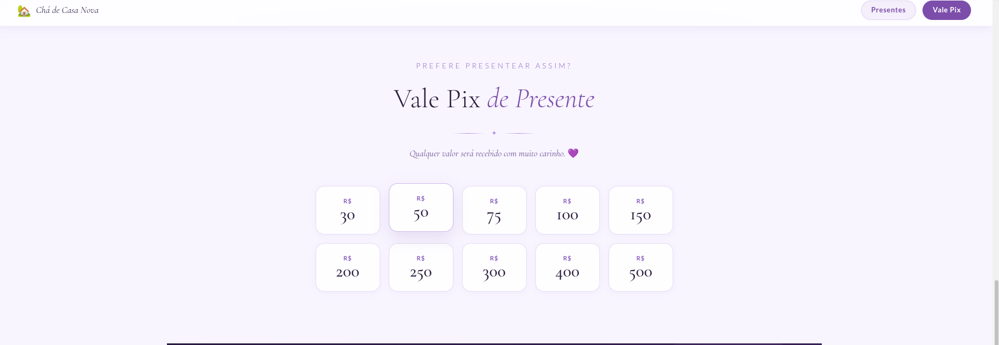

# Chá de Casa Nova — Julia & Noah 🏡

## O que é
Uma landing page de convite interativa para um chá de casa nova, desenvolvida com Vue.js + Vite, com integração ao Firebase Realtime Database para sincronização em tempo real entre todos os visitantes.

## Estrutura da página

### 1. Header fixo (`HeaderNav.vue`)
Barra de navegação fixa no topo, inicialmente transparente e que se torna um glassmorphism (vidro fosco) ao rolar a página. Contém links que fazem scroll suave até as seções de Presentes e Vale Pix.

### 2. Seção Hero (`HeroSection.vue`)
Seção de boas-vindas com fundo em gradiente lilás, pétalas decorativas animadas, título do evento, nomes dos anfitriões (Julia & Noah), data, horário e endereço do evento.

### 3. Lista de Presentes (`GiftsSection.vue`)
Grade com 20 itens de presentes em 5 colunas. Cada card exibe o nome, descrição e emoji do item. Ao clicar no card, abre o link do produto (Shopee ou outra loja). Cada card tem um botão "✅ Disponível" que, ao ser clicado, abre um modal pedindo o nome de quem vai presentear. Após confirmar, o card exibe "🎁 Reservado por [Nome]" e fica permanentemente bloqueado — o estado é salvo no Firebase e visível em tempo real para todos os visitantes da página.

### 4. Vale Pix (`PixSection.vue`)
Seção com 10 opções de valor (R$30 a R$500). Ao selecionar um valor, abre um modal exibindo a chave PIX com botão de cópia rápida.

### 5. Agradecimento (`ThanksSection.vue`)
Seção final com fundo roxo escuro, mensagem de agradecimento e assinatura de Julia & Noah.
